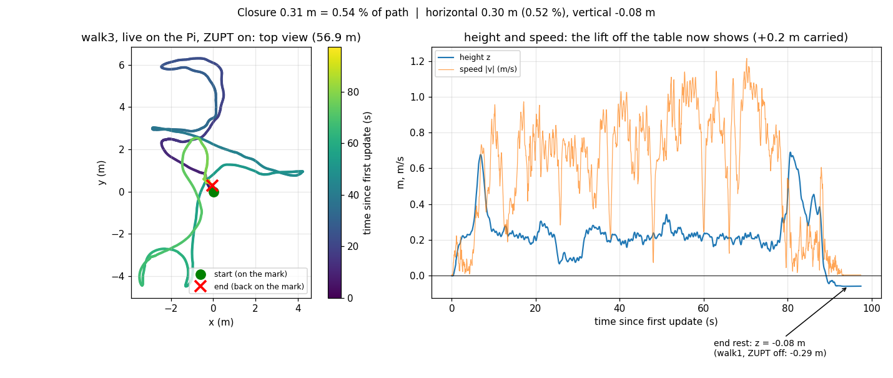

# Visual-Inertial Odometry Quadcopter

A Raspberry Pi 5 runs monocular visual-inertial odometry on a 5-inch quadcopter,
using an OV9281 global-shutter camera and ISM330DHCX IMU. OpenVINS estimates
motion; a Python MAVLink bridge feeds the estimate into ArduPilot.

The project covers sensor synchronization, camera–IMU calibration, embedded
integration, simulation, and flight evaluation. OpenVINS supplies the estimator;
this repository contains the integration, configuration, diagnostics, and
evaluation tools.

## Results and current status

| Experiment | Recorded result | Scope |
|---|---|---|
| Simulation estimator evaluation | 2.29% median drift across three flight medians; 1.91–2.89% across eight replays | Fixed-heading simulated missions; not hardware accuracy |
| Handheld hardware loop | 0.54% live endpoint closure over an estimated 56.9 m path; 25 ms average update; zero dropped frames | One recording, with four offline replays yielding 0.61–0.73% closure; not full trajectory ground truth |
| Flight integration | A documented 36-second hands-off VIO horizontal position hold | Barometer supplies altitude and compass supplies heading |

Repeatable flight drift against independently measured ground truth remains
unfinished. The [September 15 flight review](results/flight-review-2026-09-15/README.md)
documents altitude-estimation and velocity-fusion limitations. See the
[development log](docs/development-log.md) for experimental context and
[results](results/) for the measurements.



To produce an onboard camera/feature-tracking demo from a recording, use the
[tracking-video guide](docs/tracking-video.md). Tracking overlays show feature
observations, not independently measured navigation accuracy.

## Where things live

| Directory | Contents |
|---|---|
| [src/](src/) | Pi flight software, runtime configuration, missions, and tests |
| [sim/](sim/) | Gazebo worlds, ROS bridge, simulation configuration and mission scripts |
| [tools/](tools/) | Calibration, replay, analysis, diagnostics, and build scripts |
| [docs/](docs/) | Setup, hardware specifications, development history, and archived plans |
| [results/](results/) | Recorded measurements, plots, and experiment reports |

The live path is `src/vio_flight.py` → `src/vio_live.py` →
`src/vio_live/vio_live.cpp`, with `src/vio_mavlink.py` sending the resulting
poses to ArduPilot. `src/imu_log.py` also provides the sensor setup used at runtime.
Hardware runs without ROS; the simulation bridge lives in `sim/ros2/vio_bridge/`.

## Run and test

Run commands from the repository root. The hardware and simulation require
different environments; see [setup and deployment](docs/setup.md).

For the standalone Python tests on a desktop:

```sh
python3 -m venv .venv
source .venv/bin/activate
python -m pip install -r tools/requirements-test.txt
python -m pytest -q src tools/test_render_tracking.py sim/ros2/vio_bridge/test
```

Common workflows, after setting up the corresponding environment:

```sh
# Build and deploy the live software to the Pi (uses SSH; changes the Pi).
PI=viopi bash tools/build_vio.sh

# Run a recorded simulation in the configured Linux/ROS environment.
WORLD=iris_field_vio.sdf RECORD_SENSORS=1 bash sim/run_sim_vio.sh example
bash tools/analyze_run.sh ~/vio_runs/simvio_example

# Score a retained handheld estimate without hardware or ROS.
python tools/vio_closure.py results/vio_walk3_2026-09-10-live-estimate.txt
```

Simulation configuration is in `sim/config/`; hardware configuration is in
`src/config/`. The latter is specific to the calibrated sensor assembly.
Mission plans are in `src/missions/`. Historical flight-controller parameters
are in `results/config-snapshots/`, not a current recommended configuration.

Large datasets and local environments stay outside the tracked source tree.
Historical experiment records may refer to paths used before the directory
reorganization; the commands above and the setup guide use the current layout.
