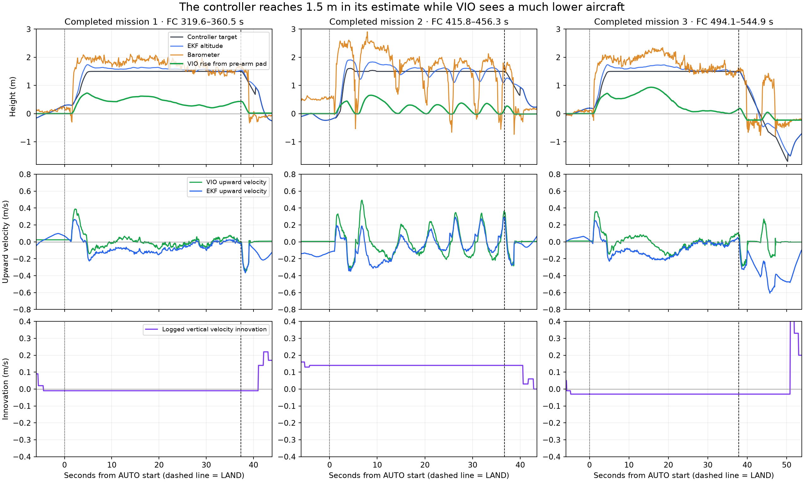

# Flight review — 15 September 2026

## Finding

The strongest explanation is **a barometer-dominated altitude estimate, compounded by a firmware path that does not fuse external vertical velocity when horizontal velocity is disabled**. The evidence does not point to OpenVINS progressively stopping or restarting between missions.

No flight parameters, deployed code, or services were changed during this review.

## Which logs contain the flights?

- `log_14`: pre-arm session; no ARM events, motor output stays off, no VISP/VISV. Reports unhealthy visual odometry and waiting for home.
- `log_15`: another pre-arm session; no ARM events. VIO messages are present, but arming reports GPS/home and approximately 14° VIO/AHRS yaw disagreement. There are gaps in this log, so its contents are not continuous coverage of that entire boot.
- **`log_16`: all three completed missions, plus an earlier AUTO attempt interrupted by switching to AltHold.** Several short arm/disarm cycles also appear.

Times below are flight-controller seconds since boot, from `TimeUS`, not the filenames' wall-clock times.

| Episode | AUTO start | Loiter command | LAND command | Disarm | Observed behavior |
|---|---:|---:|---:|---:|---|
| Earlier interrupted attempt | 205.54 s | 209.63 s | — | 250.83 s | Changed to AltHold at 228.05 s. VIO rose to about 2.7 m; this was not a completed 30-second mission. |
| Completed mission 1 | 319.56 s | 325.37 s | 356.90 s | 360.51 s | Stable low hover; VIO rise approximately 0.2–0.6 m in the settled window. |
| Completed mission 2 | 415.81 s | 419.53 s | 452.48 s | 456.31 s | Repeated returns to VIO's preflight pad height during the hold; matches the bouncing report. |
| Completed mission 3 | 494.08 s | 499.57 s | 531.96 s | 544.92 s | Low and varying VIO height, followed by a prolonged landing with another short lift. |

The numbering above follows the log; the user's remembered first successful run could refer to a different episode.

Every executed takeoff and timed-loiter item specifies **1.5 m, relative to home**; the timed loiter specifies **30 seconds**. All airborne AUTO segments use source set 2. Source set 1 is selected between flights, then set 2 again before takeoff. This is not a stale mission skipping directly to LAND.

## 1. VIO vertical velocity is received but not fused in flight

Logged configuration:

```
EK3_SRC2_POSXY = 6       External navigation position
EK3_SRC2_VELXY = 0       No horizontal velocity source
EK3_SRC2_POSZ  = 1       Barometric height
EK3_SRC2_VELZ  = 6       External navigation vertical velocity requested
EK3_SRC2_YAW   = 1       Compass
EK3_SRC_OPTIONS = 0
```

Source set 3 has the same settings. Thus “on VIO” here means VIO horizontal position, barometric altitude, and compass heading; it is not an entirely VIO-derived navigation solution.

The log identifies firmware revision **14f70f10**. In that revision's `AP_NavEKF3_PosVelFusion.cpp`:

- Lines 597–605 set the horizontal and vertical fusion flags separately.
- Lines 961 onward put the velocity consistency check behind the horizontal flag.
- **Lines 1071–1077 only enable vertical velocity fusion inside the horizontal-velocity fusion branch.** A true vertical flag alone never enables the vertical measurement update.

[Exact firmware source](https://github.com/ArduPilot/ardupilot/blob/14f70f10/libraries/AP_NavEKF3/AP_NavEKF3_PosVelFusion.cpp#L1071). A local copy is in `source/`.

The flight evidence matches: `VISV.VZ` keeps changing, but `XKF3.IVD` is exactly **−0.01, +0.14, and −0.03 m/s**, respectively, throughout the three settled flight windows. The horizontal velocity innovations also remain stale. These flat lines are not evidence of perfect agreement: the measurement update is absent. The EKF vertical velocity visibly disagrees with VIO.

This corrects the September 14 project note's assumption that setting VELZ alone added VIO velocity support on this firmware.

## 2. The controller holds its estimated 1.5 m while the aircraft is much lower



The figure subtracts the home-to-origin offset from controller and barometer heights. VIO is independently zeroed to its median during the two seconds before the corresponding final arm. It is a second estimate, not measured ground truth.

| Completed mission | Settled window, FC seconds | EKF height above home, median | VIO rise above pre-arm pad, median |
|---|---|---:|---:|
| 1 | 331–354 | 1.58 m | 0.41 m |
| 2 | 426–450 | 1.58 m | 0.21 m |
| 3 | 507–530 | 1.57 m | 0.16 m |

The last flight is not a constant 0.16 m hover: VIO rises to about 0.94 m in that window and then falls almost to its pre-arm baseline. Its eventual resting height shifts about 0.23 m, so these values must not be treated as calibrated clearance measurements. Your observed roughly 0.5 m is consistent with a low flight, but cannot be independently confirmed to that precision without range/video ground truth.

In the bouncing mission, the barometer repeatedly swings down toward ground readings as VIO returns to pad height, then jumps upward on the next lift. The controller's estimated altitude stays around the commanded height and commands another correction. In the last LAND, VIO reaches a resting plateau at approximately 534 s, moves upward again around 537–540 s, and settles before disarm at 544.92 s.

The pressure/height behavior is **consistent with airflow/prop-wash contamination and altitude-estimator error**. Barometer temperature also changes several degrees over each flight, so the logs alone do not isolate airflow from thermal effects. Normal slow VIO drift could contribute, but does not explain the missing velocity fusion.

Home is refreshed on each arm. For the completed missions its height relative to the EKF origin is +0.42, −0.12, and −0.25 m. The corresponding origin-relative controller targets are 1.92, 1.38, and 1.25 m: all correctly equal home plus 1.5 m. Those different target numbers are not a mission unit error.

## 3. Pi VIO health

The matching Pi run is `run-20260915-121608`:

- Initialized at estimator time 12.460 s; first full moving visual update at 47.515 s.
- 7,647 camera frames received and processed; **zero dropped frames**, 12 ms mean update time. IMU diagnostics stay around 440 Hz.
- The retained estimate has no frame-sized gaps beyond its normal approximately 52 ms interval.
- All **6,569** FC VISP records match that estimate's vertical position at the same remote timestamp, within floating-point precision. VISV is also present for all 6,569 records.
- **Zero ignored VISP/VISV records; reset counter remains 0.** Each completed flight receives poses at approximately 19.1 Hz; maximum per-flight gaps are 115, 68, and 78 ms. Longer gaps between flights also appear in CTUN and other FC messages, so they are log coverage gaps, not evidence of a VIO outage.
- Pi `vio_mavlink.py` and `vio_flight.py` hashes match the repository copies.
- The run did **not record raw imagery/IMU** because only 13 GB was free. Estimate and diagnostic logs are available; image tracking cannot be independently replayed from this run.

The earlier `run-20260915-120625` diagnostic and camera logs were read too; its estimate was not retained in either the listed run directory or `/run/vio`. The service journal was unavailable to the connected user, and sudo requires a password. Those limitations do not prevent matching the relevant completed missions to the retained later estimate.

The approximately 2.85 m end-to-start displacement reported by the Pi is not a valid drift score here: the aircraft changes ground position after the first interrupted flight. It should not be interpreted as 2.85 m of estimator failure.

## Recommended next steps

1. **Correct the velocity configuration before another mission test.** For this firmware, the smallest configuration workaround is `EK3_SRC2_VELXY=6`, keeping `VELZ=6`; make the same adjustment to source set 3 if that set is used. This enables all three external velocity components, so it also changes horizontal velocity aiding. The bridge already sends all three components. This was identified from source and logs, not flight-tested in this review.
2. **Verify fusion in a disarmed movement check:** select the VIO source, lift/lower and translate the aircraft, and confirm fresh velocity innovations plus sensible EKF/VIO velocity agreement. Successful message receipt alone is insufficient. An alternative is a firmware fix for vertical-only fusion, with appropriate estimator tests.
3. **Address the barometer's pressure environment.** Inspect its airflow shielding/venting and temperature behavior. `GND_EFFECT_COMP` is already **1**; enabling it is not an additional fix. ArduPilot documents prop-wash pressure contamination as a cause of near-ground bouncing and recommends moving or shielding the barometer in a ventilated enclosure. [Altitude Hold documentation](https://ardupilot.org/copter/docs/altholdmode.html).
4. For a repeatable **1.5 m above-pad** experiment, an independently measured range would help separate actual height from estimator drift. The rangefinder is currently disabled (`RNGFND1_TYPE=0`, no RFND messages). Restoring it or adding measured visual ground truth is a separate test choice; switching absolute height directly to monocular VIO is not established as a fix by these logs.

A power cycle may change the initial bias and make one attempt look better. It does not repair the demonstrated fusion path or establish accurate above-ground height.
